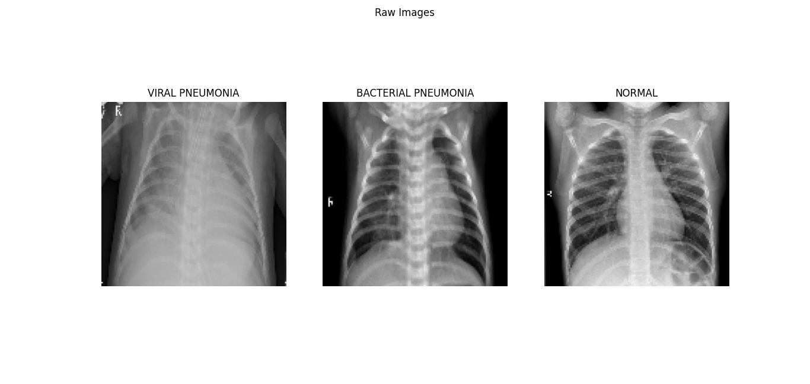
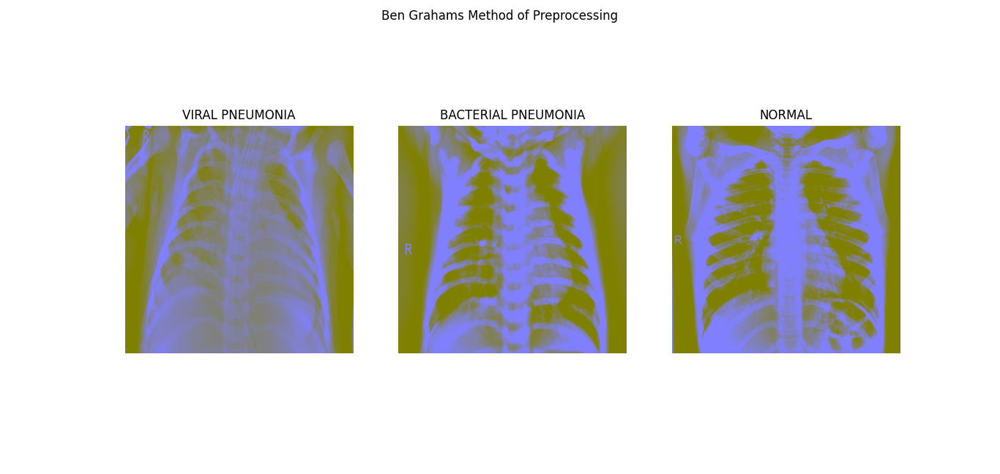
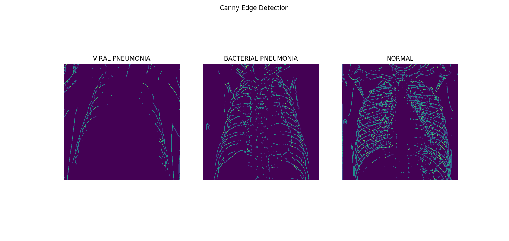
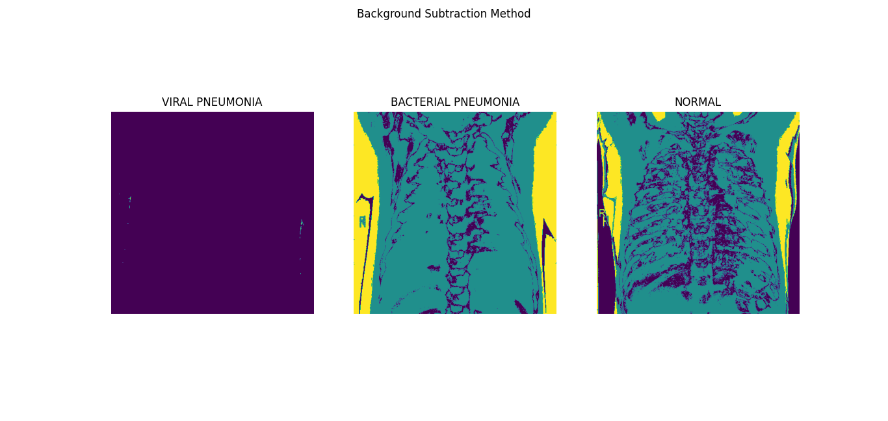

# Pneumonia Detection Using Partial Transfer Learning on Depthwise Convolutions

The risk of having pneumonia is a quite high for numerous people, especially for the ones in developing nations where billions face shortage in energy and rely on toxic forms of energy. The World Health Organization estimates that over 4 million premature deaths occur annually from household air pollution-related diseases including pneumonia. Over 150 million people get infected with pneumonia on an annual basis especially children under 5 years old. In such regions, the problem can be further aggravated due to the dearth of medical resources and personnel. For example, in 57 nations of Africa, there is a shortage of 2.3 million doctors and nurses. For these populations, accurate and fast diagnosis mean everything.

## Background

Pneumonia is a very common disease. It can be either:
- Bacterial pneumonia 
- Viral Pneumonia. 

The dataset consists of only very few samples and that too unbalanced. The aim of this project is to develop a robust deep learning model from scratch on this limited amount of data. We all know that deep learning models are data hungry but if we know how things work, we can build good models even with a limited amount of data.

## Dataset

The dataset is organized into 3 folders (train, test, val) and contains subfolders for each image category (Pneumonia/Normal). There are 5,863 X-Ray images (JPEG) and 2 categories (Pneumonia/Normal).

Chest X-ray images (anterior-posterior) were selected from retrospective cohorts of pediatric patients of one to five years old from Guangzhou Women and Children’s Medical Center, Guangzhou. All chest X-ray imaging was performed as part of patients’ routine clinical care.

For the analysis of chest x-ray images, all chest radiographs were initially screened for quality control by removing all low quality or unreadable scans. The diagnoses for the images were then graded by two expert physicians before being cleared for training the AI system. In order to account for any grading errors, the evaluation set was also checked by a third expert.

## Preview of the dataset

The normal chest X-ray (left panel) depicts clear lungs without any areas of abnormal opacification in the image. Bacterial pneumonia (middle) typically exhibits a focal lobar consolidation, whereas viral pneumonia (right) manifests with a more diffuse interstitial pattern in both lungs.

## Exploratory Data Analysis(EDA)

- **Ben Graham's method** 

- **Canny Edge Detection**

- **Background Substraction**

 

## Model

Since we have less data, **we should learn, but wisely**. We will be doing partial transfer learning and rest of the model will be trained from scratch. This is the approach we will follow when it comes to building deep learning models from scratch on limited data.

- Choose a simple architecture.
- Initialize the first few layers from a network that is pretrained on imagenet. This is because first few layers capture general details like color blobs, patches, edges, etc. Instead of randomly initialized weights for these layers, it would be much better if you fine tune them.
- Choose layers that introduce a lesser number of parameters. For example, Depthwise SeparableConv is a good replacement for Conv layer. It introduces lesser number of parameters as compared to normal convolution and as different filters are applied to each channel, it captures more information. Xception a powerful network, is built on top of such layers only. 
- Use batch norm with convolutions. As the network becomes deeper, batch norm start to play an important role.
- Add dense layers with reasonable amount of neurons. Train with a higher learning rate and experiment with the number of neurons in the dense layers. Do it for the depth of your network too.
- Once you know a good depth, start training your network with a lower learning rate along with decay.

For building the classification model, I have used the VGG-16 architecure and I simply let the weights of the first two layers remain the same and trained the remaining  layers. 

## Results

When a particular problem includes an imbalanced dataset, then accuracy isn't a good metric to look for. For example, if your dataset contains 95 negatives and 5 positives, having a model with 95% accuracy doesn't make sense at all. The classifier might label every example as negative and still achieve 95% accuracy. Hence, we need to look for alternative metrics. Precision and Recall are really good metrics for such kind of problems.

We will get the confusion matrix from our predictions and see what is the recall and precision of our model.

## Acknowledgements

### Data: https://data.mendeley.com/datasets/rscbjbr9sj/2

### License: CC BY 4.0

### Citation: http://www.cell.com/cell/fulltext/S0092-8674(18)30154-5
